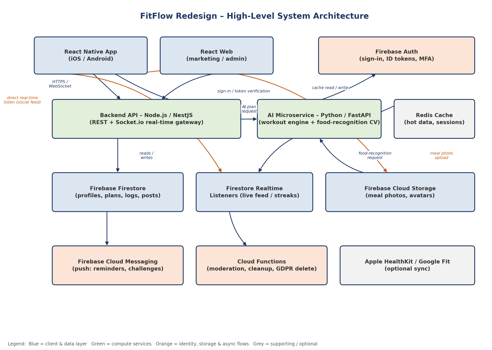

# FitFlow Redesign

A human-centred redesign of the FitFlow fitness-tracking app, addressing declining retention and
app-store ratings through an AI-powered workout engine, camera-based nutrition logging, and a
private social/community layer.

## Overview

FitFlow's user research uncovered three core pain points: poor progress visualization,
cumbersome workout logging, and limited personalization. This repository documents the
technology decisions and system architecture behind the redesign that addresses them — see
`docs/` for the full analysis.

## Tech Stack

- **Frontend:** React Native (iOS/Android), React (marketing/admin web)
- **Backend:** Node.js/NestJS (API + real-time gateway), Python/FastAPI (AI microservice)
- **Database:** Firebase (Firestore + Realtime Database)
- **Auth:** Firebase Auth
- **Cache:** Redis

Full comparison and justification: [`docs/frontend-comparison.md`](docs/frontend-comparison.md),
[`docs/backend-database-auth-comparison.md`](docs/backend-database-auth-comparison.md), and
[`docs/technology-comparison-matrix.md`](docs/technology-comparison-matrix.md).

## Architecture



Full write-up and Architecture Decision Record: [`docs/architecture-decision-record.md`](docs/architecture-decision-record.md).

## Folder Structure

```
fitflow-redesign/
├── frontend/          # React Native app
├── backend/           # NestJS API + Socket.io gateway
├── ai-service/        # FastAPI AI microservice
├── docs/              # Reports, matrix, diagram, ADRs
├── .github/workflows/ # CI (lint + test)
├── .gitignore
└── README.md
```

## Setup

Prerequisites: Node.js (LTS), npm or yarn, Python 3.11+, Firebase CLI.

```bash
# Frontend
cd frontend && npm install && npm start

# Backend
cd backend && npm install && npm run start:dev

# AI microservice
cd ai-service && pip install -r requirements.txt && uvicorn main:app --reload
```

## Contributing

- Branch naming: `feature/<short-description>` or `fix/<short-description>`
- Open a pull request against `main`; at least one review is required before merging
- Run lint/tests locally before pushing (the CI workflow will also check this)

## License

Educational project for IT3060 – Human Computer Interaction, SLIIT.
